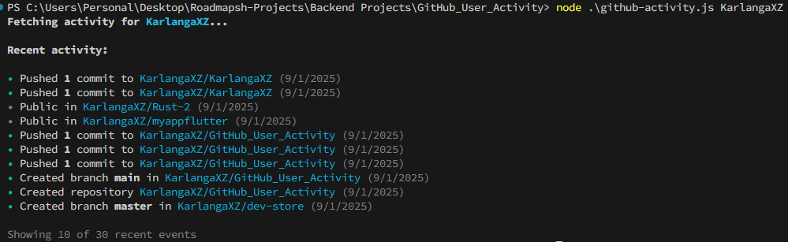
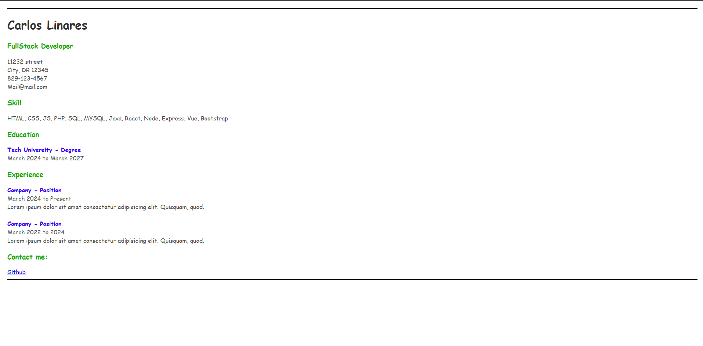

# Roadmap.sh Projects

This repository contains personal projects I build while following the roadmaps from [roadmap.sh](https://roadmap.sh).

# Projects List

- [x] [GitHub User Activity CLI](https://roadmap.sh/projects/github-user-activity)
- [x] [SinglePage CV](https://roadmap.sh/projects/single-page-cv)
- [ ] [Loading](https://github.com)

Click any of the images below to view the readme and live demo of the project.

  

    
    <h3>GitHub User Activity CLI</h3>
  

  

    
    <h3>Single Page CV</h3>
  

